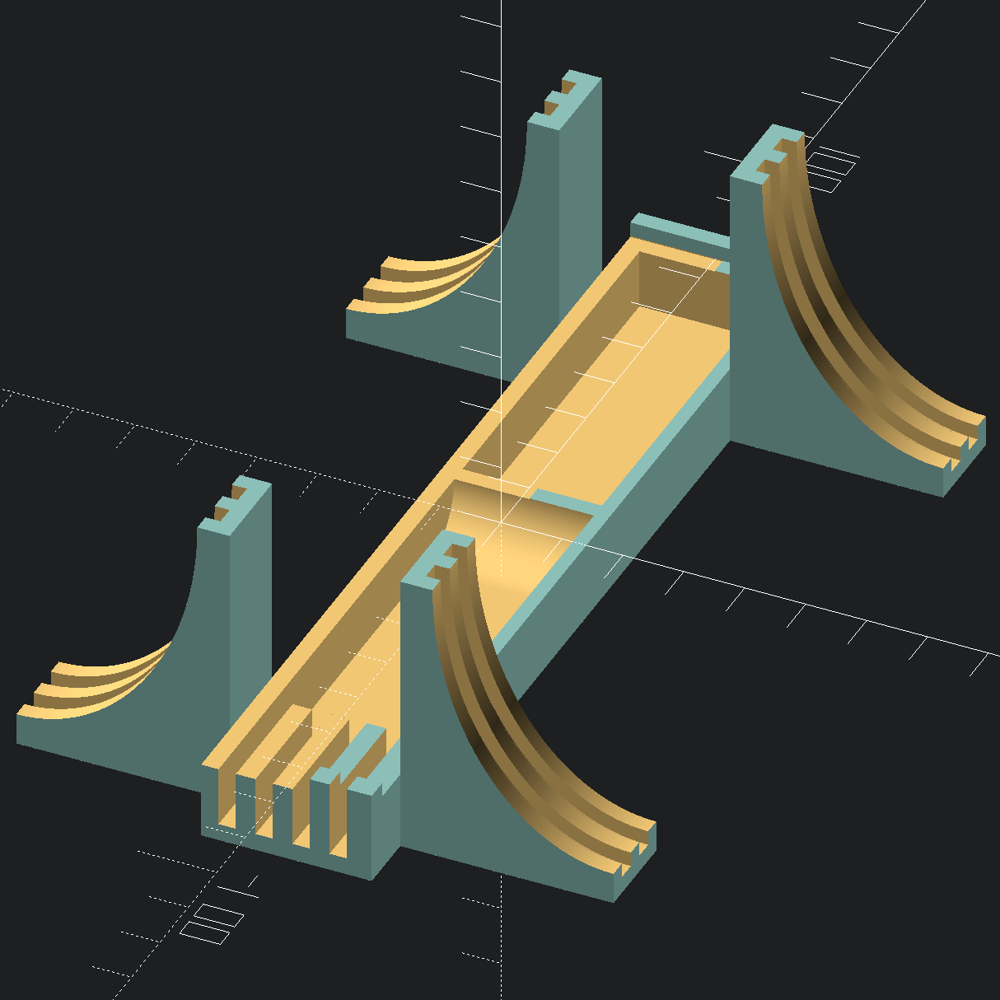
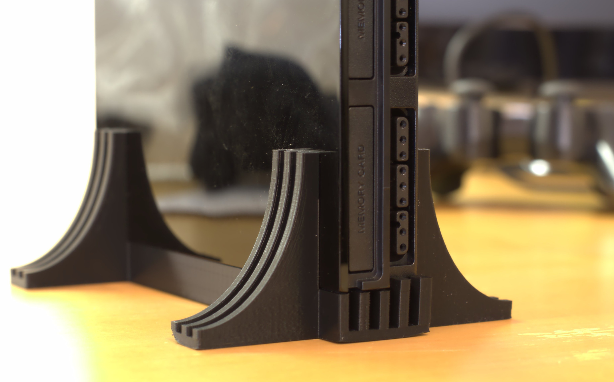
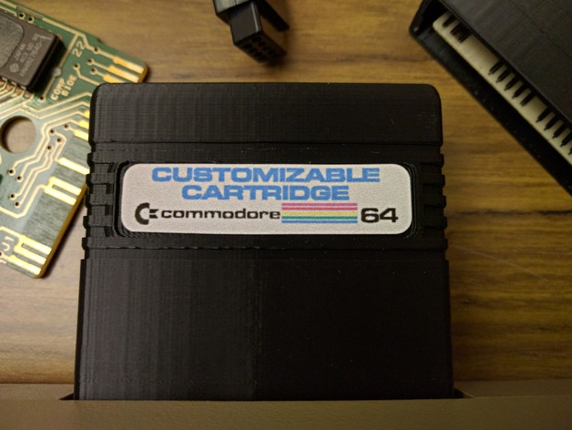
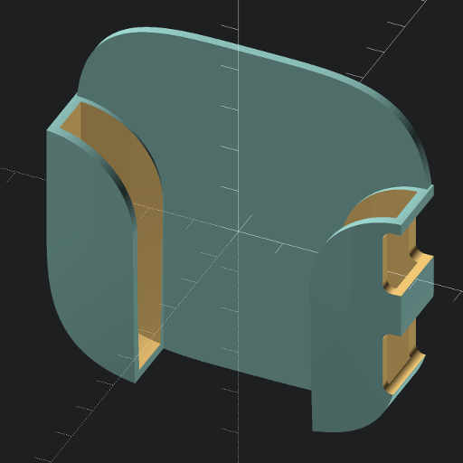
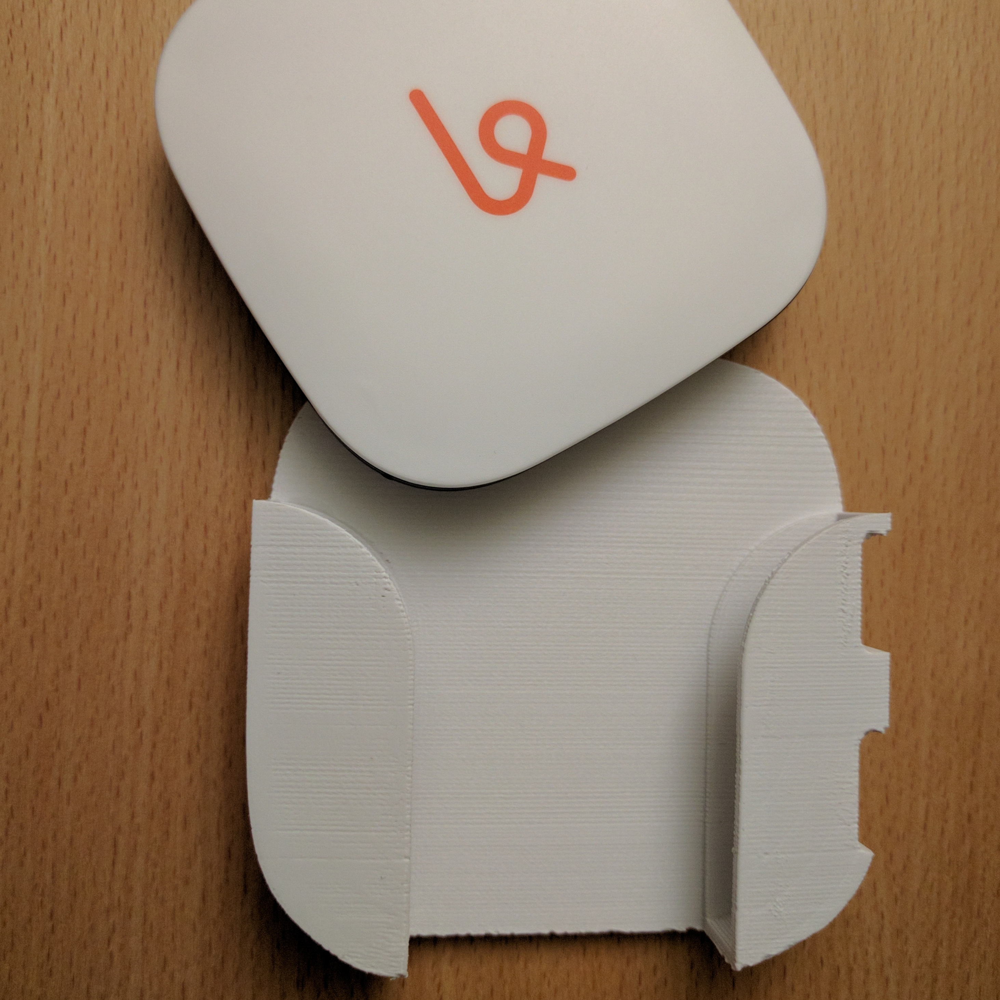
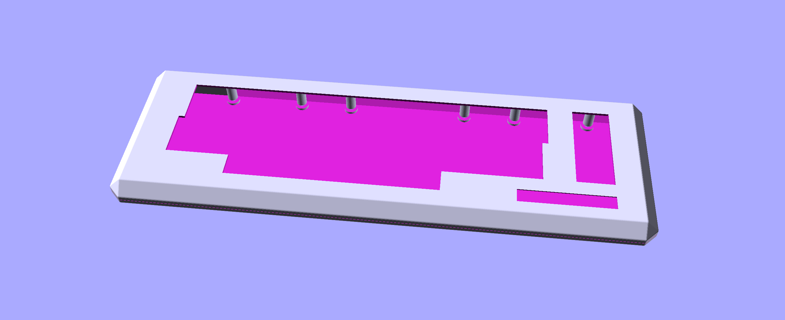
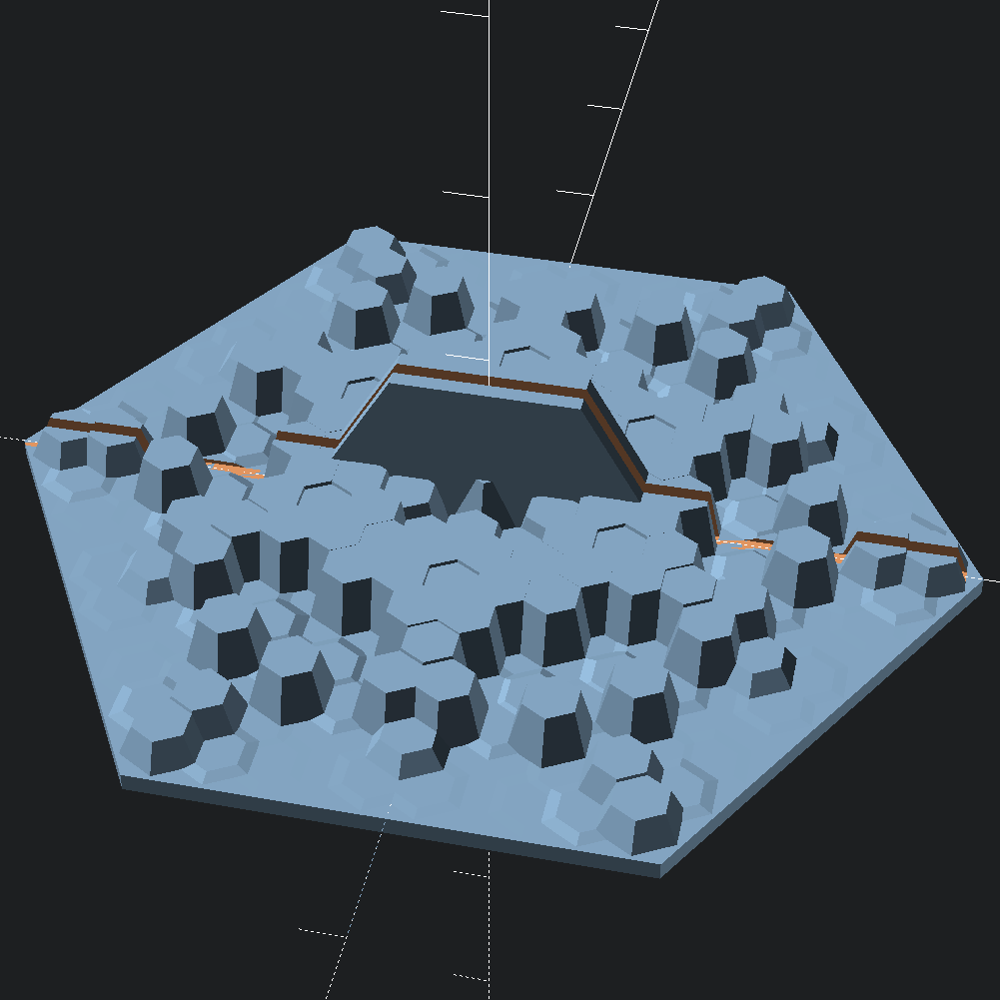
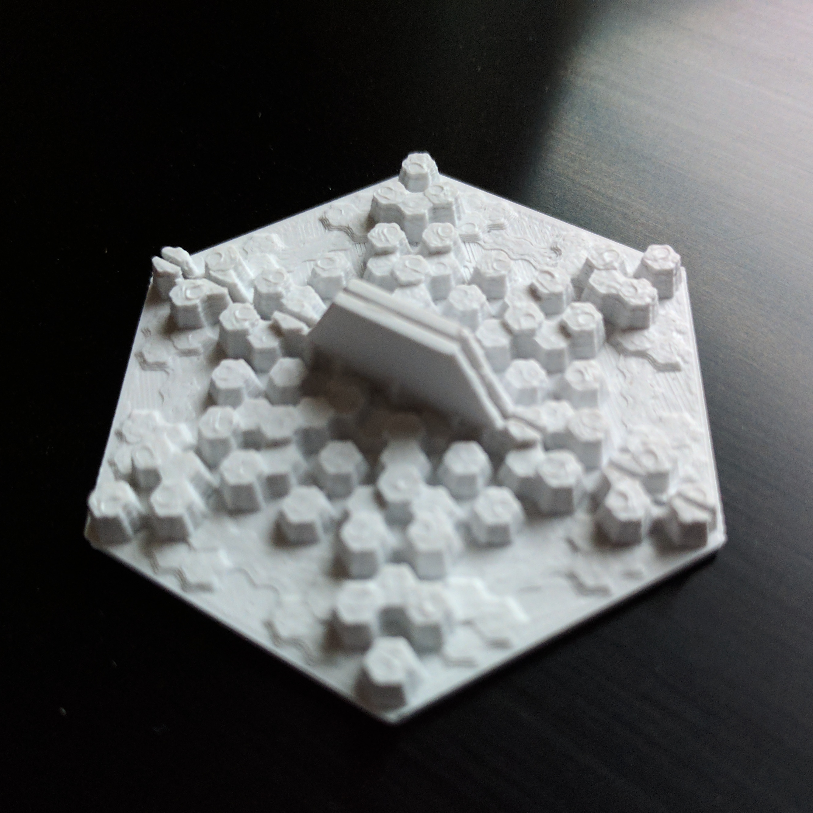
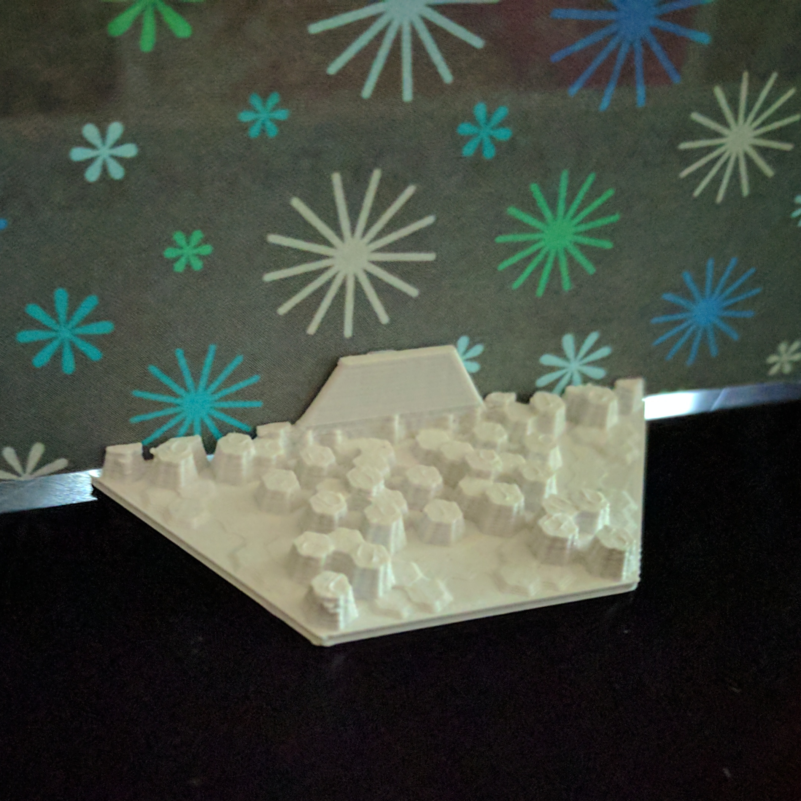

3D Models
=========

This is the source for some 3D models I have created for 3D printing. The
source here is OpenSCAD, and licensed under GPL v2.1.

Some of these models have STL files already available (sometimes with a different
license). Links for these are provided below.

I have also included Cura slicing profiles for some of the models here.

## [PlayStation2 Slim Stand](ps2-slim-stand/)

While lying horizontally the PlayStation 2 slim takes up a lot more space than
it has to. The PS2 is designed to also stand vertically (the logo even
rotates!), but it needs a stand to hold it up.

All of the stands I could find selling online were either designed for a
different revision of the PS2 slim than mine (which lacks a screw hole) or they
cover the vent holes or both. After my original PS3 cooked itself to death I'm
a bit paranoid about cooling, so I wanted a stand that would not only work with
my PS2, but which would also allow airflow to the bottom vent.

Features of this design:

- Easily printable -- there are absolutely no overhangs.
- Doesn't use too much material (or printing time).
- Provides good ventilation.
- Provides adequate support for the PS2 so it won't tip over.
- Matches the look of the PS2.

STL is available on
[Youmagine](https://www.youmagine.com/designs/playstation2-slim-stand),
[Pinshape](https://pinshape.com/items/5508-3d-printed-playstation2-slim-stand),
and
[Thingiverse](http://www.thingiverse.com/thing:1606616).

## [Customizable Commodore 64 Cartridge](c64-cartridge/)

Have an old Commodore 64 cartridge that lost its case? Have a new Commodore 64 cartridge that never had a case?

This is a 2-part cartridge case that closely mimics the design and measurements of the cartridges Commodore made for the 64 in the early 80s. This design is Customizer enabled, so you can modify it in a number of ways:

- remove debossed stripes
- punch out label hole entirely
- adjust length of cart based on PCB length
- adjust position and size of PCB mounting hole, or remove it entirely
- add support feet to the back (good for longer/heavier cartridges)

If you have other ideas for other customization parameters, feel free to contact me and I'll see what I can do.

STLs available on
[Thingiverse](http://www.thingiverse.com/thing:1702546) ([Customizer Enabled!](http://www.thingiverse.com/apps/customizer/run?thing_id=1702546)).

## [Karma Go Holder](karma-go-holder/)

This is a little holder for a [Karma Go
hotspot](https://yourkarma.com/invite/lauren7892) (full disclosure: that's an
affiliate link that gives you and me a $10 discount).  The device slots in and
fits snugly. The status lights are visible on top, and the charging port and
power button are accessible on the side. The back of the holder is flat, so
it's easily mountable with double-sided tape.

I use this in our family van, so the kids can watch Netflix during road trips,
and the hotspot doesn't take up any precious space in the tiny dashboard
compartment, yet can remain plugged into the charger. I'd previously tried just
using velcro, but the constant vibration meant the device would randomly detach
itself and roll across the floor. Kind of scary when it rolls under the brake
pedal. This holder should keep it secure while still making it possible to
easily remove the device when actually desired.

This holder may also work with the FreedomPop Freedom Spot Photon and Clear
Spot Voyager, as they seem to have the same form-factor, but I have not tested
either of them with this holder — I've never even seen them in person.

Thanks to Kit Wallace for letting me use his superellipse implementation.

STL is available on
[Youmagine](https://www.youmagine.com/designs/karma-go-holder),
[Pinshape](https://pinshape.com/items/22385-3d-printed-karma-go-holder),
and
[Thingiverse](http://www.thingiverse.com/thing:1606543).

## [Commodore 64GS Keyboard Case](c64gs-keyboard-case/)

This is a case for a Commodore 64 keyboard in the style of the Commodore 64GS
case. It was inspired by [this thread on
Twitter](https://twitter.com/laurence/status/1304610746358095872).

Please note:

1. I have never printed this. While I have tried to make the measurements
   accurate, it may not actually fit a Commodore 64 keyboard.
2. It is *very* large.
3. There currently is not a hole for cables in the design.

The case is in two pieces, and there are screw posts for mounting a C64
keyboard inside. It should also work with C16 and *some* VIC-20 keyboards. I
have seen at least one VIC-20 keyboard that may not fit. If your keyboard will
fit in a 64C case, it should fit here.

## [Snowflake Card Stand](snowflake/)

It seems flat (non-folding, postcard-style) greeting cards are becoming
increasingly popular. We wanted a way to display the cards we receive on a
table top, but non-folding cards won't stand up on their own. This little stand
fixes that.

It's also decorated with a procedurally generated snowflake, so each
card's stand can be as unique as a... I think you know where this is going.

To be honest I'm not 100% happy with the snowflake generation code, though some
random seeds look pretty nice.

## [Bike License Plate Holder](bike-license-holder/)

This is a frame for holding a small bike-size license plate, like those novelty
personalized "your name here" license plates you often see in souvenir shops.
It can be attached to a bike frame with a few cable zip ties. The plate itself
can be attached with either more zip ties, or with nuts and bolts.

## [Cookie cutter](cookie-cutter/)

This is a generalized cookie cutter. You need to have a 2D `drawing.dxf` for
the cookie cutter outline, and this will create a 3D model of an actual cookie
cutter.

A fun project to do with kids is to have them draw shapes and then convert them
into cookie cutters. Here's how I've done this:

1. Scan outline drawings of cookie cutter shapes. Clean, high-contrast images
   work best (like black marker on white paper). I then scan as line-art on a
   flatbed scanner.
2. Import the image into Inkscape.
3. Tell Inkscape to trace the image (Path → Trace Bitmap...). I've gotten good
   results with `Color quantization` mode, with `Colors` set to 2.
4. When you trace a bitmap in Inkscape it doesn't replace the original image
   object. Still in Inkscape, delete the Image object (not the "Path" object).
   The status bar at the bottom will say what kind of object is currently
   selected. You may need to drag the path aside to easily get to the image.
5. Select the path object, and  break it apart (`Path → Break Apart`). This
   will turn it into a bunch of separat Path objects.
6. Delete all paths except the ones you want to be your cookie cutters.  For
   outlined drawings, you'll end up with two paths: one for the inside, and one
   for the outside.  Keep whichever you prefer.  Once you've done this, `Edit →
   Select All` should show the correct number in the status bar. eg: "3 object
   selected of type Path". If this number is higher than it should be, then
   you've probably got some speckles that turned into tiny paths. Find them and
   delete them.
7. With the paths still selected, simplify them. (`Path → Simplify`) This will
   reduce the number of nodes significantly, which will greatly speed up
   OpenSCAD's processing.
8. OpenSCAD doesn't understand curves, only line segments. With the paths still
   selected, flatten the curves. (`Extensions → Modify Path → Flatten
   Beziers...`) I've found a "flattness" setting of 2.0 works fine.
9. Export the drawing as a DXF file. (`File → Save a Copy...`, and then select
   "Desktop Cutting Plotter (AutoCAD DXF ...) (\*.dxf)" as the file type and
   save as `drawing.dxf`.
10. On the options dialog that appears after you click `Save`:
    - Set base unit to mm.
    - Disable `use ROBO-Master`.
    - Enable `use LWPOLYLINE`.
    - Set other options as appropriate (defaults are probably fine).

This sounds like a lot, but is actually pretty quick. You then render
`cookie-cutter.scad` in OpenSCAD to create your cookie cutter models.

Look in the [`cookie-cutter/examples/`](cookie-cutter/examples/) directory for
some example of cookie cutters I've made like this (most with my kids).

NOTE: There is currently [a bug in Inkscape where it exports DXF files with the
wrong scale](https://bugs.launchpad.net/inkscape/+bug/1643383). To compensate for
this you can export a 100mm square and reimport it.  Look at the new size, and
then adjust the value of INKSCAPE_BUG_1643383 cookie-cutter.scad to the new
size that you see.

## [Commodore 128 LED Bracket](c128/)

This is a replacement bracket for the power LED in the Commodore 128.

STL is available on
[Thingiverse](http://www.thingiverse.com/thing:1692413).

## [Exercise Machine Tablet Stand](exer-tablet-stand/)

I have an elliptical trainer. I wanted to be able to watch videos on a table while running on
it. I wasn't able to find a tablet stand on the market for this elliptical
trainer, so I designed this simple bracket that mounts on top of the trainer's
control panel.

The 3D printed part is needs to be printed twice, once in mirror image. You'll
also need 3/16" threaded rod with matching nylon lock nuts, some paracord (or
other strong cord), some cable zip ties, and optionally some felt or rubber
self-adhesive feet.

The two 3D-printed components hook onto the top bezel, one at the extreme left,
and one ant the extreme right. Two threaded rods connect these. Each rod has
two lock-nuts: one on each side of each 3D-printed part (so that part can't
slide left or right).

A zip tie loop is then attached to each side, as open
as possible (ie: it zip tie just "clicks" once). The cord is then tied onto
one of these, looped under the control panel and in front of the post, and back
up the other side. Pull it as tight as possible, and connect to the other zip
tie loop. Now pull both loops tighter. This will take out the last bit of slack
from the cord, holing the entire assembly onto the bezel very firmly.

Finally, a couple of self-adhesive feet can be attached to the inside of the
upward facing "hooks" to provide some padding and/or friction so your tablet
doesn't slip off. My wife and I have both been using this for months with our
different tablets, and it works great.

## [Small Wall Bracket](small-wall-bracket/)

This is a small bracket for wall-mounting things. I used it for mounting a
Global Caché GC-100 Network Adapter. It would probably also work well for
things like routers, switches, or Raspberry Pi's in boxy cases.

Two brackets are needed for each device to be wall-mounted. One bracket goes
above the device, another goes below.  The brackets screw onto the wall, and
one cable zip tie per bracket is wrapped around the device, passing through the
slot in the bracket. The device can be removed from the wall by snipping the
zip ties. (You don't need to unscrew the brackets to remove or repplace the
device.)

## [Miele Dishwasher Thingy](miele-dishwasher/)

This is a replacement part for our Miele dishwasher. It's a little clip/hinge
thing that goes in the upper rack.  The orginal part vanished, so I printed
this up. (There was originally a pair of them, so I was able to measure the
still remaining one to create this design.)

ABS or nylon would probably work best in the harsh dishwasher environment. I
just used PLA, and it did work for a few months, but eventually warped
(probably due to heat).

## ["DIY Clock My First Clock" Replacement Pendulum Pusher](diy-clock/)

My son has a "Do-It-Yourself Clock My First Clock" kit. It fell off a table,
and one part broke. This is a replacement for that part.  In our kit this part
was yellow, and it connects between the escapement's pallet and the pendulum.
The small rod snapped off of ours, hence this replacement part.

STL is available on
[Youmagine](https://www.youmagine.com/designs/diy-clock-my-first-clock-replacement-pendulum-pusher).

## [Monitor Arm Bridge](monitor-arm-bridge/)

**NOTE: I haven't actually printed this yet, so it's a completely untested
design.**

I have two Monoprice monitor stands that each have a vertical shaft that
mounts onto the desk. My desk has a cable port in the center, so rather than
have the stands mounted centered under their respective monitor, I have them
mounted on either side of this port. This off-center placement means the two
stands tend to bow away from each other slightly, but noticeably.

This design is a "bridge" that goes between the two monitor stands. It would
be held in place by cable ties. There is a "tunnel" through the center for
cable management.

As mentioned earlier, I have not printed this yet. For now I'm just using
cable ties, which prevents the bowing, but it does mean that my monitors can
wobble a tiny bit (mostly noticeable from the webcam mounted on top of one
of my monitors., so I may end up printing this after all, as it should make
the setup a lot more rigid than it currently is.

Caveats aside, for the most part I think this design should work well, but
the measurements will most certainly need adjusting for different mounts
diameters, mount placements, and cable tie widths.

## [Rack Spacers](rack-spacers/)

I have an AV rack (just like a network rack, but for AV equipment). Because of
where it's installed, certain cable organizers that extend past the width of
the rack cannot attach onto the back rail.
These spacers make it possible to attach onto this rail, though longer screws
are required. I would not recommend using these for anything of substantial
weight. Like I said, I only use them for cable organizers.

## [Cabinet plug](cabinet-plug/)

This is a weird one. I have some cabinets in my home that had a couple of strange
rectangular openings. These openings weren't easy to see, but ants started
using them to get into the house. I made these plugs, and then filled the
openings with "Great Stuff™" expanding foam. (The small round hole in the plugs
are for the "Great Stuff" nozzle to fit through.) These are almost certainly
not useful to anyone else unaltered, but the dimensions are all in variables,
so it's easy to customize.

## [Tinker Crate Automaton crankshaft](tinkercrate-automaton/)

My son had a [Tinker Crate](http://www.kiwicrate.com/tinker) automaton. He
really loved building it, playing with it, and showing it off to his friends.
One day the crankshaft broke. The crankshaft is laser-cut plywood, and quite
skinny where it broke. We don't have a laser cutter, but I do have a 3D
printer, so we designed this replacement by scanning the original on a flatbed
scanner and then drawing on top of the scna in
[Inkscape](https://inkscape.org/). The result is pretty much identical to the
original, except plastic (we used PLA/PHA), and works great.
